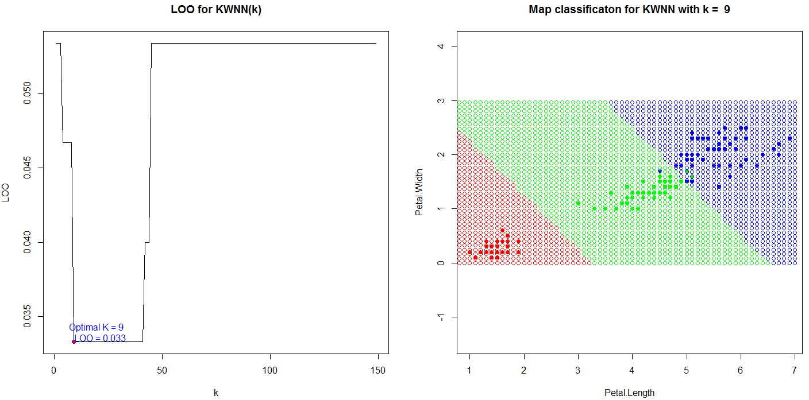

# Метрические алгоритмы классификации

Алгоритм ближайшего соседа(nearest neighbor, NN) относит классифицируемыйобъект  u ∈ Xℓ к тому классу, которому принадлежит ближайший обучающий объект: 
w(i,u) = [i= 1]; a(u;Xℓ)=y(1)u.

Этот алгоритм является, по всей видимости, самым простым классификатором.Обучение NN сводится к запоминанию выборки Xℓ. Единственное достоинство этого алгоритма простота реализации.

Недостатков гораздо больше:

* Неустойчивость к погрешностям. Если среди обучающих объектов есть выброс объект, находящийся в окружении объектов чужого класса, то не толькоон сам будет классифицирован неверно, но и те окружающие его объекты, для которых он окажется ближайшим.
* Отсутствие параметров, которые можно было бы настраивать по выборке. Алгоритм полностью зависит от того, насколько удачно выбрана метрикаρ.
* В результате низкое качество классификации.

## Алгоритм k ближайших соседей (kNN).
метод kNN относит классифицируемый объект к тому классу, к которому принадлежит большая часть из ближайших k соседей.
kNN — один из простейших алгоритмов классификации, поэтому  он зачастую оказывается неэффективным. Помимо точности классификации, также проблемой  является скорость классификации:
если в обучающей выборке N объектов, в тестовой выборе M объектов, а размерность пространства — K, значит количество операций для классификации тестовой выборки может быть оценено как O(KMN).

## Критерий скользящего контроля LOO для (kNN)

Оптимальное для точности предсказаний значение k может быть найдено с использованием перекрестной проверки. Для этого по фиксированному значению k строится модель k -ближайших соседей и оценивается ошибка классификации. Эти действия повторяются для различных k и значение, соответствующее наименьшей ошибке распознавания, принимается как оптимальное.

## Метод k взвешенных ближайших соседей (kwNN)

Данный алгоритм классификации относит объект u к тому классу y, у которого максимальна сумма весов из его k соседей, то есть объект относится к тому классу, который набирает больший суммарный вес среди k ближайших соседей. В данном алгоритме, помимо функции расстояния, используется весовая функция, которая оценивает степень важности при классификации заданного объекта к какому-либо классу, что и отличает его от алгоритма kNN.

# Байесовские алгоритмы классификации
Байесовский подход основан на теореме, утверждающей, что если плотности распределения каждого из классов известны, то искомый алгоритм можно выписать в явном аналитическом виде. Более того, этот алгоритм оптимален, то есть обладает минимальной вероятностью ошибок.

Так как на практике плотности распределения классов, обычно, не известны. То их приходится оценивать (восстанавливать) по обучающей выборке. В результате мы получаем, что байесовский алгоритм перестаёт быть оптимальным, так как восстановить плотность
по выборке можно только с некоторой погрешностью. Чем короче выборка, тем выше шансы «подогнать» распределение под конкретные данные и столкнуться с эффектом переобучения.

Байесовский подход к классификации является одним из старейших, но до сих пор сохраняет прочные позиции в теории распознавания. Он лежит в основе многих удачных алгоритмических моделей.
## Линии уровня
 * 1.Если признаки коррелированы, то матрица  не диагональна и линии уровня имеют форму эллипсоидов, оси которых повернуты ( направлены вдоль собственных векторов матрицы equation ) относительно исходной системы координат.

