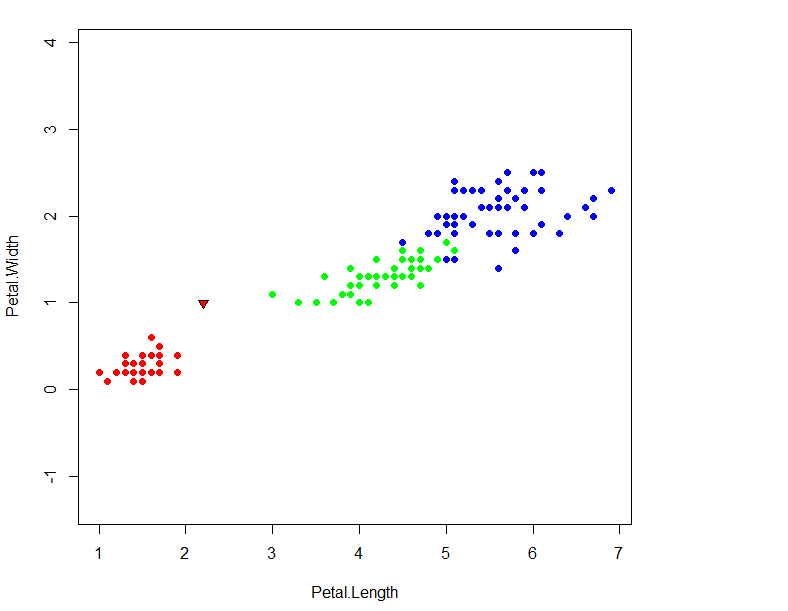
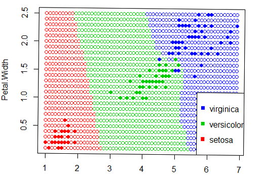

# Метрические алгоритмы классификации
 - [Алгоритм ближайшего соседа](#Алгоритм-ближайшего-соседа)
 - [Алгоритм k ближайших соседей](#Алгоритм-k-ближайших-соседей-(kNN).)
 - [Метод k взвешенных ближайших соседей](#Метод-k-взвешенных-ближайших-соседей-(kwNN))
 - [Метод парзеновского окна](#Метод-парзеновского-окна)
 - [Метод Потенциальных функций](#Метод-Потенциальных-функций)
 - [Алгоритм STOLP](#Алгоритм-STOLP)
# Байесовские алгоритмы классификации
 - [Линии уровня](#Линии-уровня)
 - [Наивный байесовский классификатор](#Наивный-байесовский-классификатор)
 - [Линейный дискриминант Фишера](#Линейный-дискриминант-Фишера)
 
## Алгоритм ближайшего соседа

Алгоритм ближайшего соседа(nearest neighbor, NN) относит классифицируемыйобъект  u ∈ Xℓ к тому классу, которому принадлежит ближайший обучающий объект: 
w(i,u) = [i= 1]; a(u;Xℓ)=y(1)u.

Этот алгоритм является, по всей видимости, самым простым классификатором.Обучение NN сводится к запоминанию выборки Xℓ. Единственное достоинство этого алгоритма простота реализации.

Недостатков гораздо больше:

* Неустойчивость к погрешностям. Если среди обучающих объектов есть выброс объект, находящийся в окружении объектов чужого класса, то не толькоон сам будет классифицирован неверно, но и те окружающие его объекты, для которых он окажется ближайшим.
* Отсутствие параметров, которые можно было бы настраивать по выборке. Алгоритм полностью зависит от того, насколько удачно выбрана метрикаρ.
* В результате низкое качество классификации.





## Алгоритм k ближайших соседей (kNN).
метод kNN относит классифицируемый объект к тому классу, к которому принадлежит большая часть из ближайших k соседей.
kNN — один из простейших алгоритмов классификации, поэтому  он зачастую оказывается неэффективным. Помимо точности классификации, также проблемой  является скорость классификации:
если в обучающей выборке N объектов, в тестовой выборе M объектов, а размерность пространства — K, значит количество операций для классификации тестовой выборки может быть оценено как O(KMN).



## Критерий скользящего контроля LOO для (kNN)

Оптимальное для точности предсказаний значение k может быть найдено с использованием перекрестной проверки. Для этого по фиксированному значению k строится модель k -ближайших соседей и оценивается ошибка классификации. Эти действия повторяются для различных k и значение, соответствующее наименьшей ошибке распознавания, принимается как оптимальное.


## Метод k взвешенных ближайших соседей (kwNN)

Данный алгоритм классификации относит объект u к тому классу y, у которого максимальна сумма весов из его k соседей, то есть объект относится к тому классу, который набирает больший суммарный вес среди k ближайших соседей. В данном алгоритме, помимо функции расстояния, используется весовая функция, которая оценивает степень важности при классификации заданного объекта к какому-либо классу, что и отличает его от алгоритма kNN.


# Метод парзеновского окна

Рассмотрим весовую функция 
  как функцию не от ранга соседа, а как функция от расстояния  


,где K - невозрастающая и неотрицательная функция ядра  
В этом случае метрический классификатор:
 

h - шириной окна , u - играет ту же роль, что и число соседей. "Окно" - это сферическая окрестность u радиуса h, при попадании в которою облегающий объект xi голосует за отнесение объекта u к классу yi

## Ядро Прямоугольное


 
Реализация функции
```
rectangle <- function(r,h){
  if(abs(r/h) <= 1){
      return (0.5)
    } 
   else {
      return(0)
  }
}
```

## Ядро Гаусса


 
Реализация функции

```R
gaus <- function(r,h){
    return ( (2*pi)^(-1/2) * exp(-1/2 * (r/h)^2 ) )
}
```
## Плюсы Парзеновского окна:
- При правильно выбраном h алгоритм способен классифицировать объект с хорошим качеством;
- Алгоритм прост в реализации;
- Учитывются все точки с одинаковым расстоянием;
## Минусы:
- Нужно подбирать h для каждой выборке
- Требуется хранить выборку целиком;


# Метод Потенциальных функций
---
Если в методе Парзеновского окна, центр окна поместить в классифицируемый объект, то получим метод Потенциальных функций.


Реализация потенциальной функции:

```
pot_func <- function(potentials,xl,y,h){

n <- dim(xl)[1]
w <- rep(0,3)
names(w) <- c("setosa", "versicolor", "virginica")

for(i in 1:n)
{
   x <- xl[i,1:2]
   class <- xl[i,3]
   r <- euclideanDistance(x,y);
   w[class] <- potentials[i]*gaus(r,h)+w[class]

}

class <- names(which.max(w))

if(max(w)==0){
   return ("0")
}
else{
   return (class)
}

}
```

Результат работы алгоритма для Гауссовского ядра, при h=1


## Плюсы:

- высокая точность классификации

## Минусы:

- сложная реализация
- при маленьком eps долгое выполнение


## Алгоритм STOLP

Отступ - величина, показывающая, степень типичности объекта к классу. Отступ равен разности между степенью близости объекта к своему классу и максимальной близостью объекта к в другому классу. Отступ отрицателен, тогда и только тогда, когда алгоритм допускает ошибку на данном объекте.
 

Объекты по отступам делятся на виды:

 - Эталонные объекты - наиболее типичные представители своего класса. (Отступ - большое положительное число)
 - Неинформативные - объекты, не влияющие значительным образом на качество классификации (Отступ - положительное число)
 - Пограничные - объекты, имеющие отступ, близкий к нулю. Незначительное изменение в выборке может повлиять на их классификацию.
 - Ошибочные - объекты с отрицательными отступами, классифицируемые неверно. 
 - Шумовые объекты (выбросы) - малая группа объектов с большими отрицательными отступами. Их удаление улучшает качество классификации.

Алгоритм СТОЛП (STOLP) — алгоритм отбора эталонных объектов для метрического классификатора. Смысл алгоритма, оставить в выборке только эталонные объекты. На вход подаётся выборка, допустимый порог ошибок и порог фильтрации выбросов.

Алгоритм:

1. Удалить из выборки ошибочные элементы.
2. Взять по одному объекту из каждого класса с наибольшим отступом и добавить в множество эталонов.
3. Классифицировать объекты обучающей выборки, взяв в качестве обучающей выборки для этого множество эталонов. Посчитать число ошибок.
4. Если число меньше заданного числа, то завершить алгоритм.
5. Иначе присоединить ко множеству эталонов объекты с наименьшим отступом из каждого класса.
6.Повторять шаги 3-5 до тех пор, пока множество эталонов и обучающая выборка не совпадут.

Функция нахождения отступа:

```R
margin <- function(xl,classes,z,class){

	class1 <- xl[which(classes==class), ]
	class2 <- xl[which(classes!=class), ]
	margin <- parzen(class1,z[1:2],1) - parzen(class2,z[1:2],1)
	return(margin)
}

```

# Байесовские алгоритмы классификации
Байесовский подход основан на теореме, утверждающей, что если плотности распределения каждого из классов известны, то искомый алгоритм можно выписать в явном аналитическом виде. Более того, этот алгоритм оптимален, то есть обладает минимальной вероятностью ошибок.

Так как на практике плотности распределения классов, обычно, не известны. То их приходится оценивать (восстанавливать) по обучающей выборке. В результате мы получаем, что байесовский алгоритм перестаёт быть оптимальным, так как восстановить плотность
по выборке можно только с некоторой погрешностью. Чем короче выборка, тем выше шансы «подогнать» распределение под конкретные данные и столкнуться с эффектом переобучения.

Байесовский подход к классификации является одним из старейших, но до сих пор сохраняет прочные позиции в теории распознавания. Он лежит в основе многих удачных алгоритмических моделей.

## Линии уровня
 * 1.Если признаки коррелированы, то матрица  не диагональна и линии уровня имеют форму эллипсоидов, оси которых повернуты ( направлены вдоль собственных векторов матрицы  ) относительно исходной системы координат.
 * 2.Если признаки имеют одинаковые дисперсии 
 * 3.Если признаки некоррелированы, , то линии уровня плотности распределения имеют форму эллипсоидов с центром )

С помощью ортогонального преобразования  . - ортогональные собственные векторы матрицы , можно перейти к третьему случаю.

Реализация 

```R
line <- function(m,A)
{
	determ<-det(A)
	
	a <- A[2,2]/determ
	b <- -A[2,1]/determ
	c <- -A[1,2]/determ
	d <- A[1,1]/determ
	
	x0 <- m[1]
	y0 <- m[2]
  
	x <- seq(-2.5, 2.5, 0.1)
	y <- seq(-2.5, 2.5, 0.1)
	
	A <- d
	B <- a
	C <- -c-b
	D <- -2*d*x0+y0*(c+b)
	E <- -2*a*y0+x0*(c+b)
	F <- d*x0^2+a*y0^2+x0*y0*(-c-b)
	
	func <- function(x, y) {
    	1/(2*pi*sqrt(determ))*exp((-1/2)*(x^2*A + y^2*B + x*y*C + x*D + y*E + F))
	}
	
	z <- outer(x, y, func)
  
	contour(x, y, z)
}
```

1.Если признаки некорелированы, то линия уровня плотности распределения имеют форму элипсоидов.

 

2.Если признаки имеют одинаковые дисперсии, то элипсоиды являются сферами.

 

3.Если признаки корелированы, то матрица не диагональна и линии уровня имеют форму элипсоидов, оси которых повернуты относительно исходной системы координат.

 

## Наивный байесовский классификатор
Допустим, что объекты  описываются n признаками . Обозначим через 
произвольный элемент пространства объектов  где .

Признаки . являются независимыми случайными величинами. Следовательно, функции правдоподобия классов представимы в виде:

.
где . — плотность распределения значений j-го признака для класса y.

Наивный байесовский классификатор – это семейство алгоритмов классификации, которые принимают одно допущение: Каждый признак классифицируемых данных рассматривается независимо от других параметров класса.

Признаки называется независимыми, если значение одного признака не влияет на другой.

Метод называется наивным, так как мы предпологаем, что все признаки набора независимы друг от друга - это предположение достаточно наивное. Обычно так не бывает.
Упрощенное уравнение для классификации выглядит так:

.
Рассмотрим уравнение, это дробь. 

Числитель дроби - это вероятность признака 1, принадлежащего классу А, умноженная на вероятность признака 2, принадлежащего классу А, умноженная на вероятность класса А.

Знаменатель дроби – это вероятность признака 1 умноженная на вероятность признака 2.

Реализация

```R
naiv <- function(x, mu, sigma, lamda, P){
	n <- 2
	res <- log(lamda*P)
	
	for(i in 1 : n){
		pyj <- (1/(sigma[i]*sqrt(2*pi))) * exp(-1 * ((x[i] - mu[i])^2)/(2*sigma[i]^2))
    	res <- res + log(pyj)
	}
	
	return(res)
}

```

### Пример
Имеется выборка 


Построим карту классификации для наивного байесовского алгоритма 


Преимущества:
* Простота реализации 
* Низкие вычислительные затраты при обучении и классификации.

Недостаток — относительно низкое качество классификации
в большинстве реальных задач.

## Линейный дискриминант Фишера
Рассмотрим равные ковариационные матрицы классов. Нам хватить оценить одну ковариационную матрицу по всем обьектам обучающей выборке.
Оценка вычисляется по формуле:

.

Наша разделяющая поверхность линейная.
Тогда подстановочный алгоритм принимает вид:
.

Алгоритм называется линейным дискриминантом Фишера.
Формула разделяющей плоскости:
.

Нахождения коэффициентов:
.
